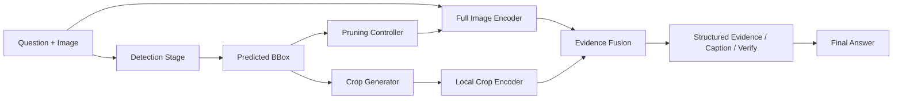
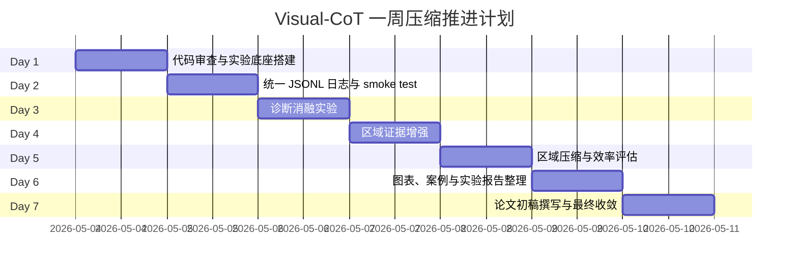
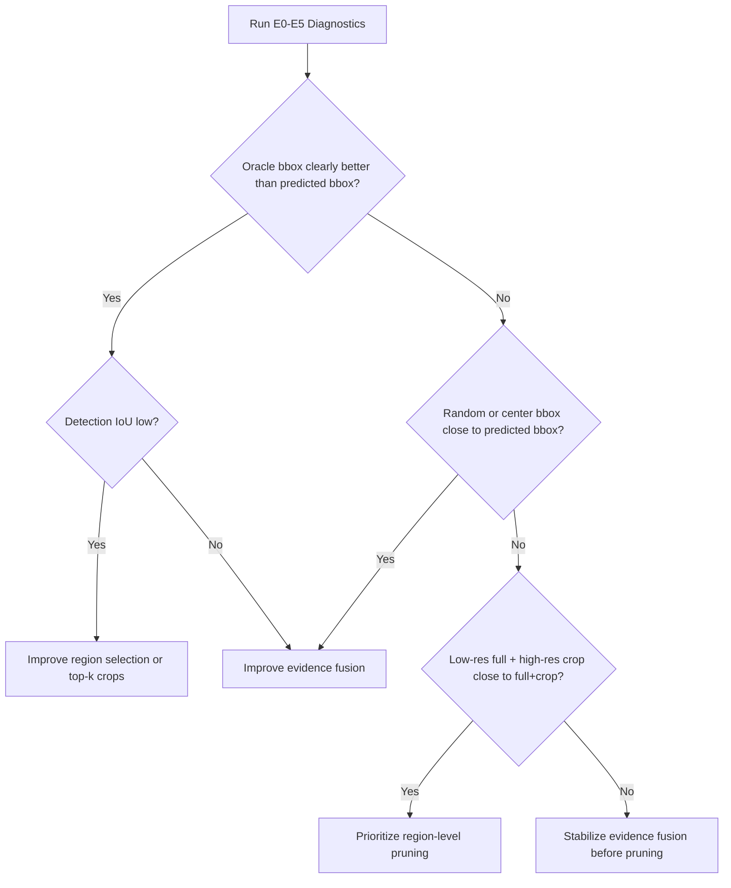

# Visual-CoT 实验平台说明

## 目标

本实验平台服务于“基于模态混合的视觉语言模型推理增强方法的设计与实现”。代码在原 Visual-CoT detection 到 answer 两阶段流程上扩展，不训练模型，不跑完整 benchmark，优先完成可复现的小规模诊断实验。

## 实验矩阵

### 阶段 1：Pilot 实验

样本量：每个数据集 20 条。当前优先使用 CUB；TextVQA、DocVQA、SROIE 只在图片完整时运行。

模式：`full`、`pred_bbox`、`random_bbox`、`center_bbox`、`woimg`。

### 阶段 2：诊断实验

样本量：每个数据集 50 到 100 条。

模式：`full`、`pred_bbox`、`oracle_bbox`、`random_bbox`、`center_bbox`、`woimg`、`crop_only`。

目的：判断瓶颈来自 bbox 定位，还是 answer 阶段没有用好局部证据。

### 阶段 3：区域证据增强实验

模式：`pred_bbox`、`structured_evidence`、`region_caption`、`answer_verifier`。

目的：判断结构化证据、区域描述、自检机制是否提升回答稳定性。

### 阶段 4：区域压缩实验

模式：`full`、`pred_bbox`、`crop_only`、`lowres_full_highrescrop`、`topk_crops`。

目的：比较 accuracy、latency、memory、crop_ratio。

### 阶段 5：正式实验

最小目标：CUB 或已完整配置的数据集 >= 100 条；输出主结果表、消融实验表、效率对比表、误差分类表和案例图。

## 评价指标

答案质量：normalized exact match、substring match、TextVQA 近似 accuracy、DocVQA ANLS。

bbox 质量：IoU、IoU > 0.5 Accuracy、bbox_parse_ok ratio。

效率指标：latency_ms、peak_gpu_memory_mb、num_visual_inputs、num_visual_tokens_est、crop_ratio。

诊断指标：oracle_pred_gap、random_pred_gap、center_pred_gap、woimg_gap、crop_only_gap。

## 推荐命令

```bash
bash experiments/scripts/run_pilot.sh --datasets cub --max-samples 2
bash experiments/scripts/run_diagnostics.sh --datasets cub --max-samples 20
bash experiments/scripts/run_latency_benchmark.sh --dataset cub --max-samples 20
```

正式实验脚本默认不运行，需要显式传 `--run`：

```bash
bash experiments/scripts/run_formal_eval.sh --max-samples 100
bash experiments/scripts/run_formal_eval.sh --run --max-samples 100
```

## 方法流程图



## 一周计划



## 实验决策图


